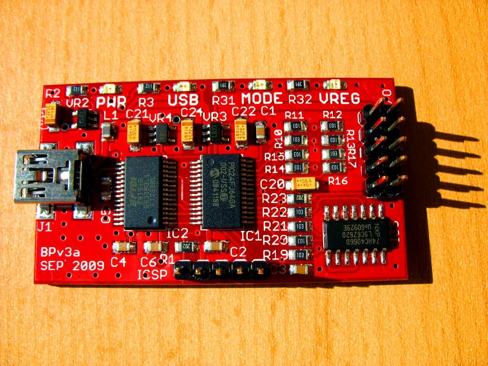
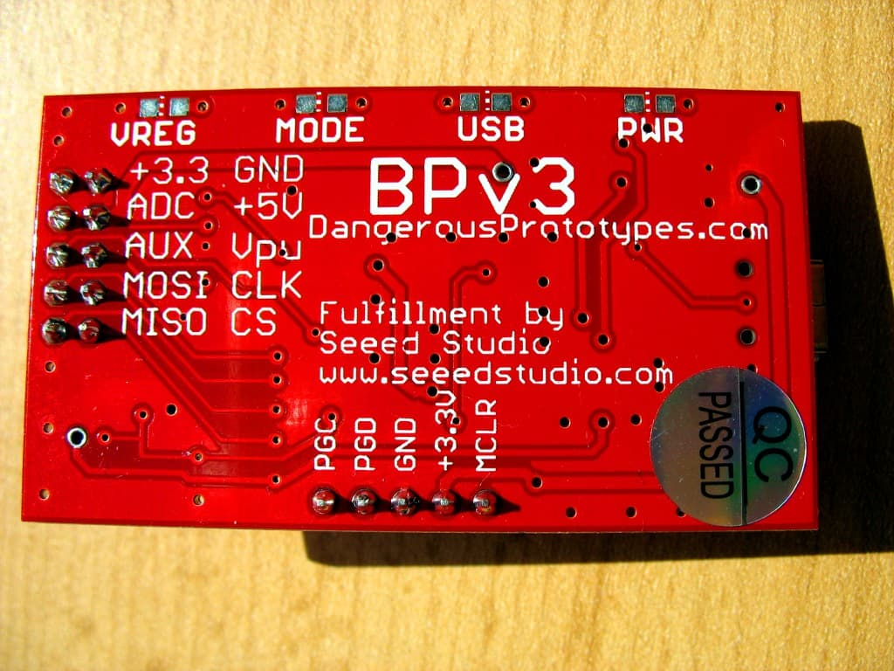

==========
Bus Pirate
==========

The `Bus Pirate <http://dangerousprototypes.com/docs/Bus_Pirate>`_ is an open source design
for a multi-purpose chip-level serial protocol transceiver and debugger.
flashrom supports the Bus Pirate for `SPI programming <http://dangerousprototypes.com/docs/SPI>`_.
It also has `SPI sniffing <http://dangerousprototypes.com/docs/Bus_Pirate_binary_SPI_sniffer_utility>`_
functionality, which may come in useful for analysing chip or programmer behaviour.

They are available for around US$30 from various sources.

Connections
===========

The table below shows how a typical SPI flash chip (sitting in the center of the table)
needs to be connected (NB: not all flash chips feature all of the pins below, but in general
you should always connect all input pins of ICs to some defined potential (usually GND or VCC),
ideally with a pull-up/down resistor in between). Most SPI flash chips require a 3.3V supply voltage,
but there exist some models that use e.g. 1.8V. Make sure the device in question is compatible
before connecting any wires.

*NB: Some rather rare SPI flash chips (e.g. Atmel AT45DB series) have a completely different layout, please beware.*

+----------------------+------------+------+---------------------------------+------+------------+-----------------------------+
|  Description	       | Bus Pirate | Dir. | Flash chip			     | Dir. | Bus Pirate | Description		       |
+======================+============+======+===+===========+=============+===+======+============+=============================+
| (not) Chip Select    | CS	    | →	   | 1 | /CS	   | VCC	 | 8 | ←    | +3.3v	 | Supply		       |
+----------------------+------------+------+---+-----------+-------------+---+------+------------+-----------------------------+
| Master In, Slave Out | MISO	    | ←	   | 2 | DO (IO1)  | /HOLD (IO3) | 7 | ←    | +3.3v	 | (not) hold (see datasheets) |
+----------------------+------------+------+---+-----------+-------------+---+------+------------+-----------------------------+
| (not) Write Protect  | +3.3v	    | →    | 3 | /WP (IO2) | CLK	 | 6 | ←    | CLK	 | The SPI clock               |
+----------------------+------------+------+---+-----------+-------------+---+------+------------+-----------------------------+
| Ground	       | GND	    | →	   | 4 | GND	   | DI (IO0)    | 5 | ←    | MOSI	 | Master Out, Slave In        |
+----------------------+------------+------+---+-----------+-------------+---+------+------------+-----------------------------+

Usage
=========

::

  $ flashrom -p buspirate_spi:dev=/dev/device,spispeed=frequency

Example::

  $ flashrom -p buspirate_spi:dev=/dev/ttyUSB0,spispeed=1M

Troubleshooting
===============

In case of problems probing the chip with flashrom - especially when connecting chips
still soldered in a system - please take a look at the doc :doc:`/user_docs/in_system`. In-system programming is often possible
**only as long as no other devices on the SPI bus are trying to access the device**.

Speedup
=========

A beta firmware build exists, to speed up the buspirate.
`See this post on dangerousprototypes.com <http://dangerousprototypes.com/forum/viewtopic.php?f=40&t=3864&start=15#p41505>`_

See also: http://dangerousprototypes.com/docs/Bus_Pirate#Firmware_upgrades

Images
==========

Bus Pirate v3, front.

Bus Pirate v3, back.

Recovering a bricked Lycom PE-115 88SE8123 PCIe to SATA adapter using flashrom and a Bus Pirate - power to the
PE-115 is supplied by a PC. The test probes of the bus pirate are attached directly to the SOIC Atmel AT26F004 SPI flash chip.
The other test clip is connected to GND on another device for convenience (easier than getting yet another clip onto a SOIC device).

.. image:: Lycom-pe115-flashrom-buspirate-2.jpg
