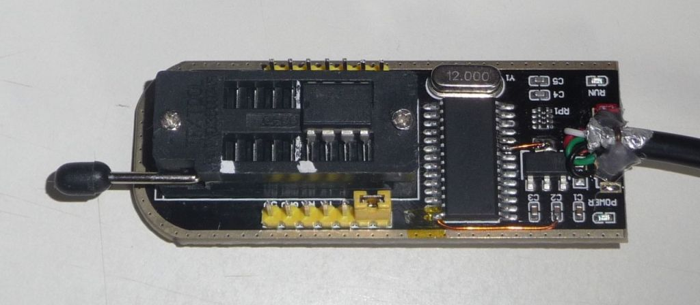
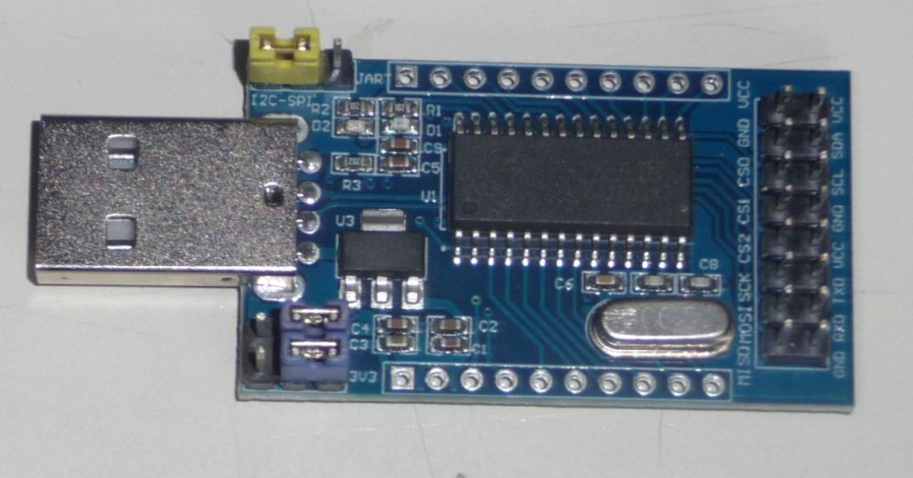
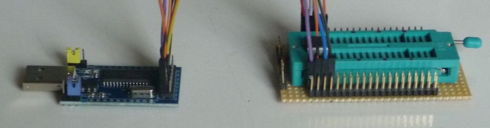
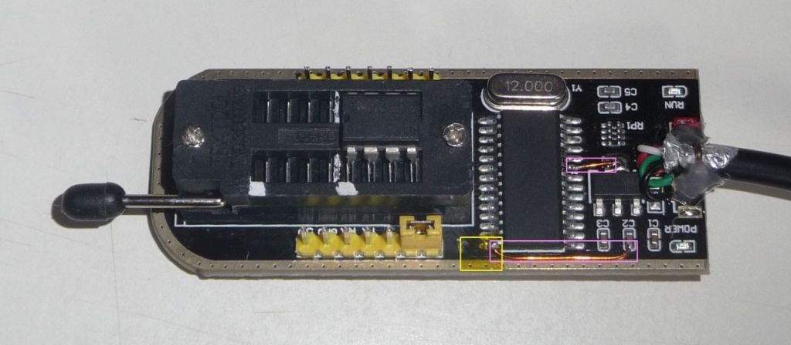
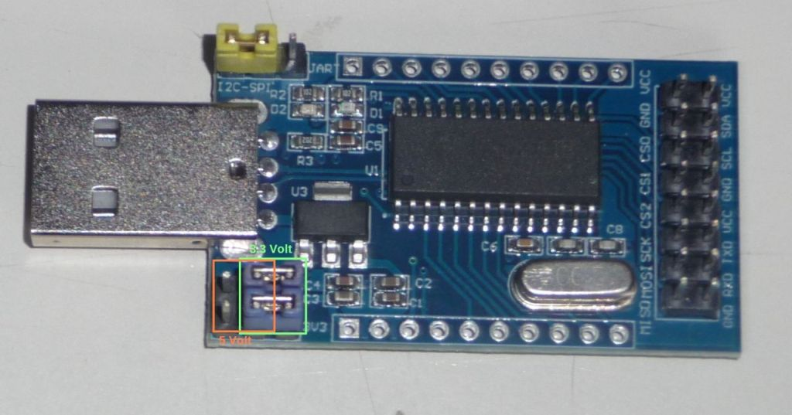
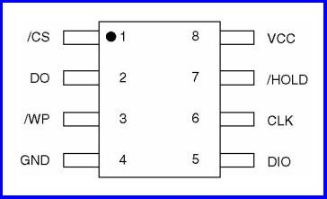

=========
CH341A/B
=========

.. meta::
   :author: Stephan Schneider

The CH341\ **A** is a chip that provides a bridge between USB and serial communication. The
CH341\ **B** is almost identical, it also has a built-in oscillator. However, it is not
recommended to use the CH341\ **B** with the built-in oscillator and without a crystal
as the accuracy of the built-in oscillator is very poor and timing problems can occur
during data transmission. The serial communication of the CH341A/B can be UART or SPI/I2C,
here we are only interested in the SPI/I2C mode. The following description applies to both
chips, it does not matter which one you have. With a crystal, flashrom works with both the
CH341A and the CH341B without changing the software.

There are 2 ready-made boards that are suitable for use with flashrom, one with an IC socket
(Textool) with a mostly black board and one without an IC socket with a mostly blue board.

Image 1: Black board with IC socket

Image 2: Blue board without IC socket

Both boards have advantages and disadvantages. The black board with IC socket is more practical
because the IC socket is already installed. However, it has an error in the circuit diagram that
must be corrected so as not to jeopardize the EEPROMs. There is a voltage converter on the board to
convert the 5 volts of the USB to 3.3 volts, the 3.3 volts are then fed to the IC socket, but
unfortunately the CH341A is still supplied with 5 volts. The CH341A also works with 5 volts, but then
there is a voltage of just under 5 volts at the outputs of the CH341A that lead to the IC socket,
which is usually too much for the inputs of the EEPROMs and can cause them to break. The blue board
without an IC socket is correctly designed, but you also need an IC socket and some connecting wires,
which makes things complicated and error-prone.

Image 3: Blue board and additional IC socket with wiring

The conversion of the black circuit board with IC socket is simple: You need a soldering iron,
some insulated wire, some insulating tape and a steady hand. First you need to lift pin 28 of the
CH341A by approx. 1 mm, heat the pin with the soldering iron and insert a thin knife blade between
the pin and the board. Then stick a small piece of insulating tape between the pin and the circuit
board to prevent contact. Then you have to connect the bent up pin 28 with 3.3 volts and pin 9 also
with 3.3 volts, the connections are shown in the next picture.

Image 4: Yellow: insulating tape, pink: new connections

For programming with flashrom you have to set the SPI/I2C mode of the CH341A, the corresponding jumper
must be set to the position shown in the pictures (it is the yellow jumper in each case). On the blue
board without IC socket you have to set the operating voltage with 2 jumpers (here blue), this is
usually 3.3 volts, there are only a few older EEPROMs that still require 5 volts, please check the data
sheet of the EEPROM to be on the safe side.

Image 5: Green: 3.3 Volt, orange: 5 Volt

When using the blue board, you still have to make the correct connections between the EEPROM and the CH341A board:

+---------------+--------------+
| Pin 1 -> CS0  | Pin 8 -> Vcc |
+---------------+--------------+
| Pin 2 -> MISO | Pin 7 -> Vcc |
+---------------+--------------+
| Pin 3 -> Vcc  | Pin 6 ➔ SCK  |
+---------------+--------------+
| Pin 4 -> GND  | Pin 5 ➔ MOSI |
+---------------+--------------+

Pin 1 of the EEPROM is usually marked with a dot or similar, see also the EEPROM data sheet

Image 6: Pinout of an EEPROM

The following commands are some examples how to call flashrom with CH341A::

     flashrom -p ch341a_spi
     flashrom -p ch341a_spi -r filename.bin
     flashrom -p ch341a_spi -w filename.bin

That's all, good luck!
