==========
FT2232 SPI
==========

flashrom supports the ``-p ft2232_spi`` (or ``-p ft2232spi`` in very old flashrom revisions) option
which allows you to use an FTDI FT2232/FT4232H/FT232H based device as external SPI programmer.

This is made possible by using `libftdi <http://www.intra2net.com/en/developer/libftdi/>`_.
flashrom autodetects the presence of libftdi headers and enables FT2232/FT4232H/FT232H support if they are available.

Currently known FT2232/FT4232H/FT232H based devices which can be used as SPI programmer
together with flashrom are described below.

DLP Design DLP-USB1232H
=======================

The `DLP Design DLP-USB1232H <http://www.dlpdesign.com/usb/usb1232h.shtml>`_
(`datasheet DLP-USB1232H <http://www.dlpdesign.com/usb1232h-ds-v13.pdf>`_) can be used with flashrom
for programming SPI chips.

Where to buy: `Digikey <https://www.digikey.com/>`_,
`Mouser <https://www.mouser.de/ProductDetail/?qs=sGAEpiMZZMt/5FJRvmqHBjWi/VTYGDW6>`_,
`Saelig <https://www.saelig.com/product/UB068.htm>`_

Setup
-----

DLP-USB1232H based SPI programmer schematics

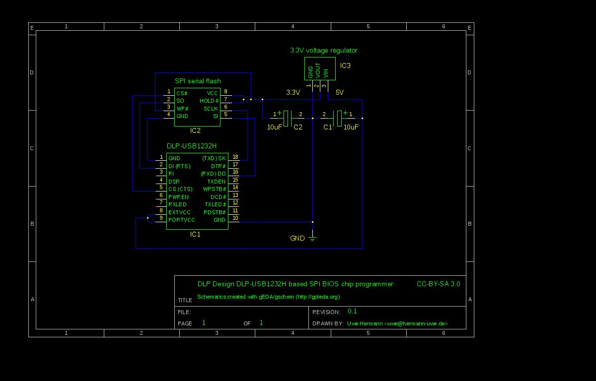

In order to use the DLP-USB1232H device as SPI programmer you have to setup a small circuit
(e.g. on a breadboard). See the schematics for details (you can also
`download the schematics as PDF <http://www.coreboot.org/images/2/26/Dlp_usb1232h_spi_programmer.pdf>`_
for easier printing).

What you will need
------------------

=============== ======================= =============   ======  ===============================================
Quantity	Device			Footprint	Value	Comments
=============== ======================= =============	======	===============================================
1		DLP Design DLP-USB1232H —		—	...
1		Breadboard		—		—	...
many		Jumper wires		—		—	...
1		DIP-8 SPI chip		—		—	This is the chip you want to program/read/erase
1		3.3V voltage regulator	TO-220		3.3V	E.g. **LD33V** or **LD1117xx**
1		Electrolytic capacitor	single ended	100nF	...
1		Electrolytic capacitor	single ended	10uF	...
=============== ======================= =============   ======  ===============================================

Instructions and hints
----------------------

* You must connect/shorten pins 8 and 9, which configures the device to be powered by USB.
  Without this connection it will not be powered, and thus not be detected by your OS
  (e.g. it will not appear in the ``lsusb`` output).

* You need a 3.3V voltage regulator to convert the 5V from USB to 3.3V,
  so you can power the 3.3V SPI BIOS chip.

  * You can probably use pretty much any 3.3V voltage regulator, e.g. **LD33V** or **LD1117xx**.
    For usage on a breadboard the TO-220 packaging is probably most useful.
  * You have to connect two capacitors (e.g. 100nF and 10uF as per datasheets,
    but using two 10uF capacitors, or even two 47uF capacitors also works in practice) as shown in the schematics,
    otherwise the voltage regulator will not work correctly and reliably.

* Connect the following pins from the DLP-USB1232H to the SPI BIOS chip:

  * **18 (SK)** to **SCLK**
  * **16 (DO)** to **SI**
  * **2 (DI)** to **SO**
  * **5 (CS)** to **CS#**
  * The **WP# and HOLD#** pins should be tied to **VCC**! If you leave them unconnected
    you'll likely experience strange issues.
  * All **GND** pins should be connected together (**pins 1i and 10** on the DLP-USB1232H,
    **pin 8** on the SPI chip, **pin 1** on the voltage regulator).

You have to invoke flashrom with the following parameters::

  $ flashrom -p ft2232_spi:type=2232H,port=A

Photos
------

Module, top

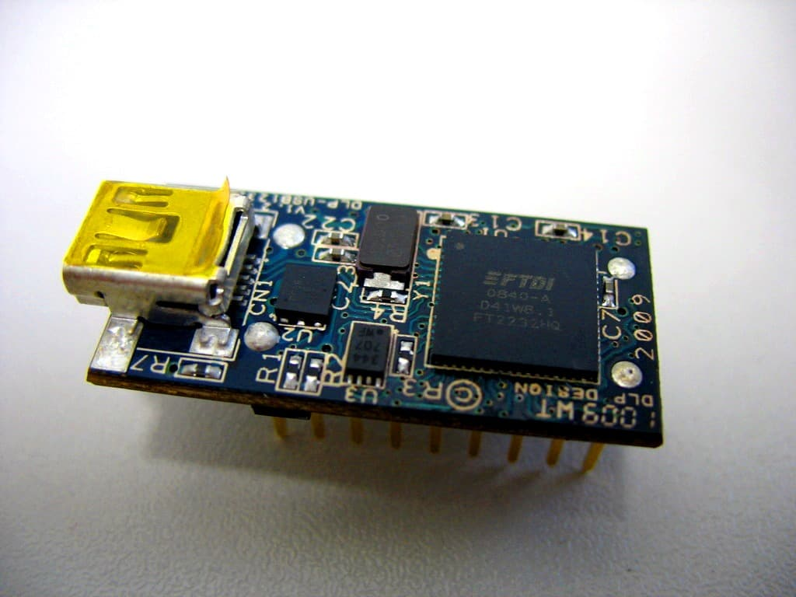

Module, bottom

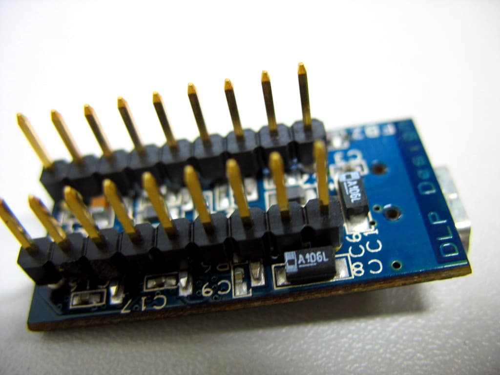

SPI header on a mainboard

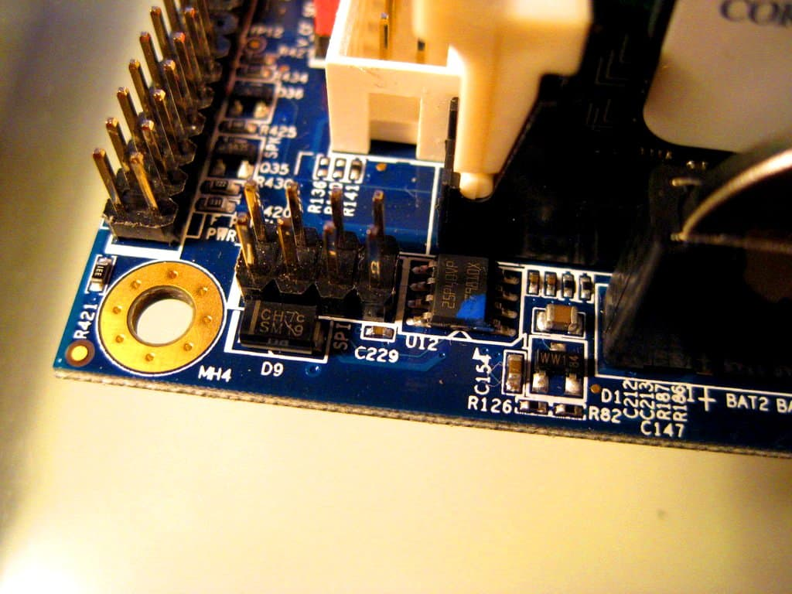

Module on a breadboard, connected to the mainboard's SPI header

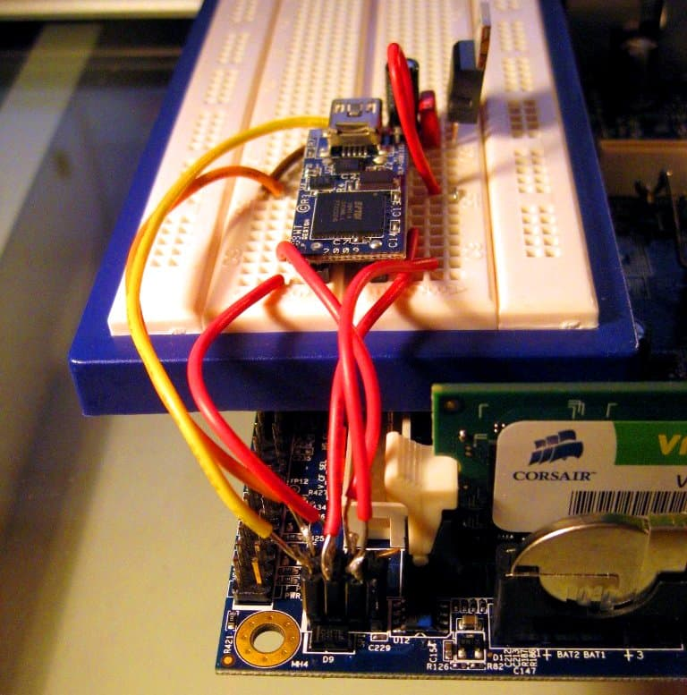

Breadboard setup

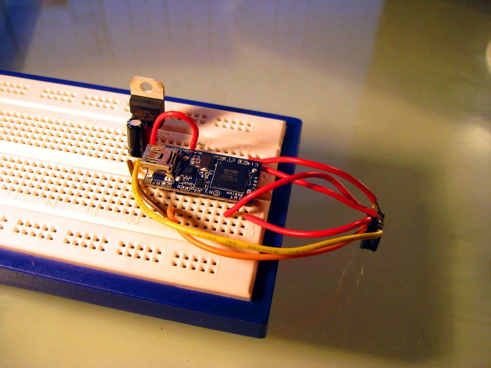

Another breadboard setup

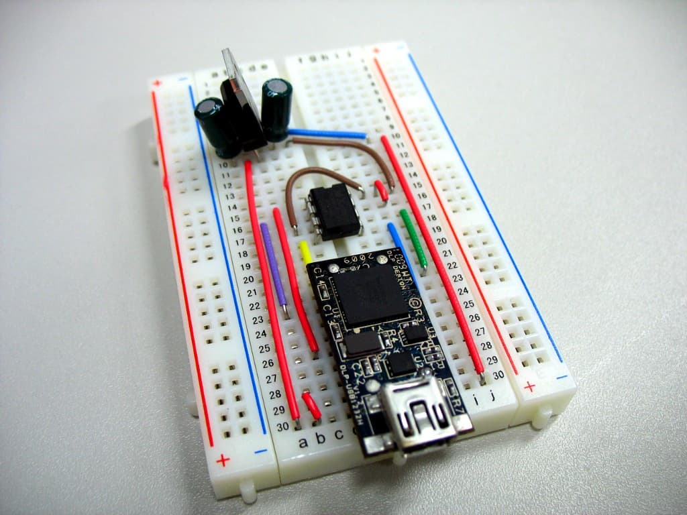

Module and parts

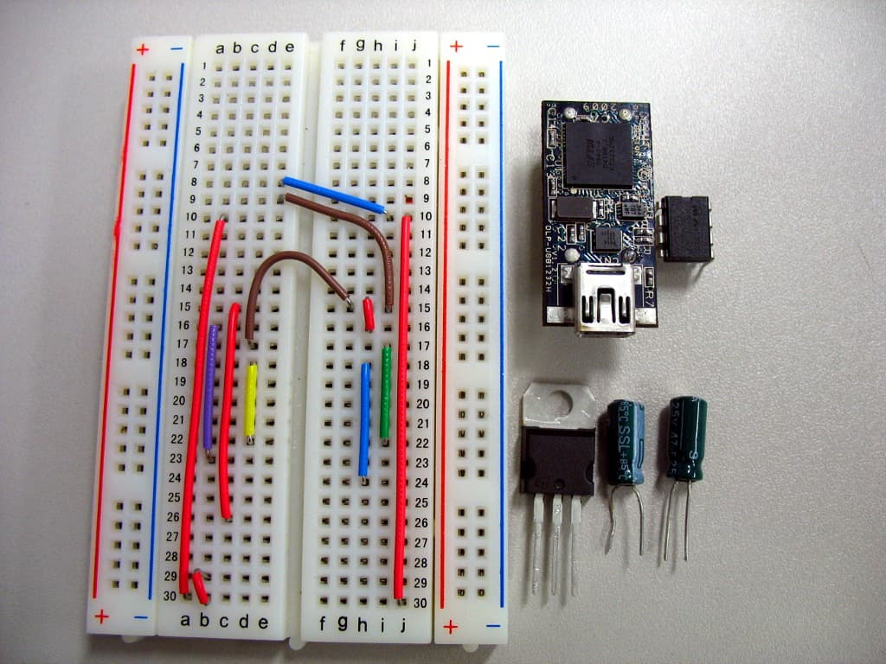

FTDI FT2232H Mini-Module
========================

The `FTDI FT2232H Mini-Module Evaluation Kit <http://www.ftdichip.com/Products/Modules/DevelopmentModules.htm#FT2232H%20Mini%20Module>`_
(`the datasheet <http://www.ftdichip.com/Support/Documents/DataSheets/Modules/DS_FT2232H_Mini_Module.pdf>`_)
can be used with flashrom for programming SPI chips.

Pinout
------

=============== ======= ======= =============== ===========================
Module Pin	FTDI	MPSSE	SPI		SPI Flash (vendor specific)
=============== ======= ======= =============== ===========================
CN2-7		AD0	TCK/SK	(S)CLK		(S)CLK
CN2-10		AD1	TDI/DO	MOSI		SI / DI
CN2-9		AD2	TDO/DI	MISO		SO / DO
CN2-12		AD3	TMS/CS	/CS / /SS	/CS
CN3-26		BD0	TCK/SK	(S)CLK		(S)CLK
CN3-25		BD1	TDI/DO	MOSI		SI / DI
CN3-24		BD2	TDO/DI	MISO		SO / DO
CN3-23		BD3	TMS/CS	/CS / /SS	/CS
=============== ======= ======= =============== ===========================

FTDI FT4232H Mini-Module
========================

The `FTDI FT4232H Mini-Module Evaluation Kit <http://www.ftdichip.com/Products/Modules/DevelopmentModules.htm#FT4232H%20Mini%20Module>`_
(`datasheet <http://www.ftdichip.com/Support/Documents/DataSheets/Modules/DS_FT4232H_Mini_Module.pdf>`_)
can be used with flashrom for programming SPI chips.

Olimex ARM-USB-TINY/-H and ARM-USB-OCD/-H
=========================================

The `Olimex <http://www.olimex.com/dev/index.html>`_ `ARM-USB-TINY <http://www.olimex.com/dev/arm-usb-tiny.html>`_
(VID:PID 15BA:0004) and `ARM-USB-OCD <http://www.olimex.com/dev/arm-usb-ocd.html>`_ (15BA:0003)
can be used with flashrom for programming SPI chips.
The `ARM-USB-TINY-H <http://www.olimex.com/dev/arm-usb-tiny-h.html>`_ (15BA:002A)
and `ARM-USB-OCD-H <http://www.olimex.com/dev/arm-usb-ocd-h.html>`_ (15BA:002B) should also work,
though the tested status is unconfirmed.

The following setup can then be used to flash a BIOS chip through SPI.

Pinout:

 .. image:: ARM-USB-TINY_pinout.png

=============== =========================
Pin (JTAG Name)	SPI/Voltage Source
=============== =========================
1 (VREF)	VCC (from Voltage Source)
2 (VTARGET)	VCC (to SPI target)
4 (GND)		GND (from Voltage Source)
5 (TDI)		SI
6 (GND)		GND (to SPI target)
7 (TMS)		CE#
9 (TCK)		SCK
13 (TDO)	SO
=============== =========================

On the ARM-USB-TINY, VREF, and VTARGET are internally connected, and all the GND lines
(even numbered pins, from 4 to 20) share the same line as well, so they can be used
to split VCC/GND between the voltage source and the target.

The voltage source should provide 3.0V to 3.3V DC but doesn't have to come from USB:
it can be as simple as two AA or AAA batteries placed in serial (2 x 1.5V).

Invoking flashrom
-----------------

You first need to add the ``-p ft2232_spi`` option, and then specify one of ``arm-usb-tiny``,
``arm-usb-tiny-h``, ``arm-usb-ocd`` or ``arm-usb-ocd-f`` for the type.
For instance, to use an ARM-USB-TINY, you would use::

  $ flashrom -p ft2232_spi:type=arm-usb-tiny

Openmoko
========

The openmoko debug board (which can also do serial+jtag for the openmoko phones, or for other phones)
has `its shematics available here <http://people.openmoko.org/joerg/schematics/debug_board/OpenMoKo_Debug_Board_V3_MP.pdf>`_.

Informations
------------

The openmoko debug board can act as an SPI programmer bitbanging the FTDI
(no need of an openmoko phone), you just need:

* a breadboard
* some wires
* The openmoko debug board(v2 and after,but only tested with v3)

The voltage is provided by the board itself. The connector to use is the JTAG one
(very similar to what's documented in the previous section(Olimex ARM-USB-TINY/-H and ARM-USB-OCD/-H )

Building
--------

**WARNING: This was tested with 3.3v chips only.**

Here's the pinout of the JTAG connector of the openmoko debug board
(copied from ARM-USB-tiny because it's the same pinout):

 .. image:: ARM-USB-TINY_pinout.png

=============== =============================== ========================
Pin (JTAG Name)	SPI/Voltage Source		BIOS Chip connector name
=============== =============================== ========================
1 (VREF)	VCC (from Voltage Source)	VCC (3.3v only)
2 (VTARGET)	VCC (to SPI target)		Not connected
4 (GND)		GND (from Voltage Source)	Ground
5 (TDI)		SI				DIO (Data Input)
6 (GND)		GND (to SPI target)		Not connected
7 (TMS)		CE#				CS (Chip select)
9 (TCK)		SCK				CLK (Clock)
13 (TDO)	SO				DO (Data output)
=============== =============================== ========================

* Also connect the BIOS chip's write protect(WP) to VCC

* Also connect the BIOS chips's HOLD to VCC

Pictures
--------

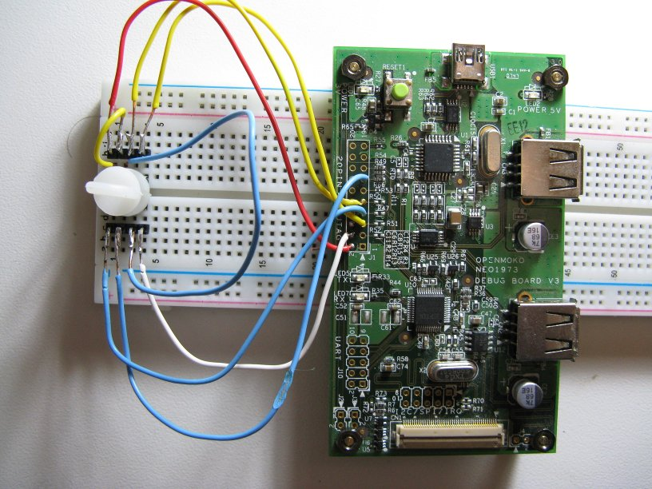

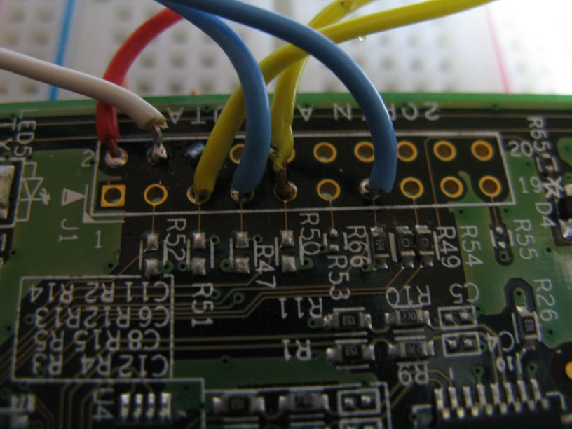

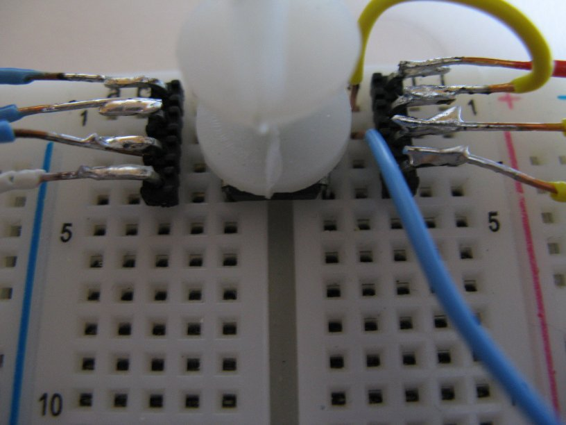

Performances
------------

::

  $ time ./flashrom/flashrom -p ft2232_spi:type=openmoko -r coreboot.rom
  flashrom v0.9.5.2-r1545 on Linux 3.0.0-20-generic (x86_64)
  flashrom is free software, get the source code at http://www.flashrom.org

  Calibrating delay loop... OK.
  Found Winbond flash chip "W25X80" (1024 kB, SPI) on ft2232_spi.
  Reading flash... done.

  real	0m19.459s
  user	0m1.244s
  sys	0m0.000s

::

  $ time ./flashrom/flashrom -p ft2232_spi:type=openmoko -w coreboot.rom
  flashrom v0.9.5.2-r1545 on Linux 3.0.0-20-generic (x86_64)
  flashrom is free software, get the source code at http://www.flashrom.org

  Calibrating delay loop... OK.
  Found Winbond flash chip "W25X80" (1024 kB, SPI) on ft2232_spi.
  Reading old flash chip contents... done.
  Erasing and writing flash chip... Erase/write done.
  Verifying flash... VERIFIED.

  real	1m1.366s
  user	0m7.692s
  sys	0m0.044s

Advantages/disadvantages
------------------------

* fast(see above)

* easily available (many people in the free software world have openmoko debug board
  and they don't know what to do with them), can still be bought

* stable

* SPI only

Generic Pinout
==============

There are many more simple modules that feature the FT*232H.
Actual pinouts depend on each module, the FTDI names map to SPI as follows:

=============== ======= =============== ===========================
Pin Name	MPSSE	SPI		SPI Flash (vendor specific)
=============== ======= =============== ===========================
DBUS0		TCK/SK	(S)CLK		(S)CLK
DBUS1		TDI/DO	MOSI		SI / DI
DBUS2		TDO/DI	MISO		SO / DO
DBUS3		TMS/CS	/CS / /SS	/CS
=============== ======= =============== ===========================
