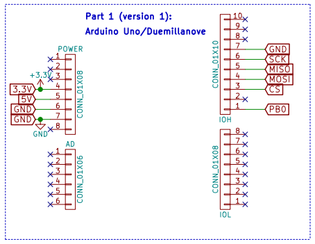
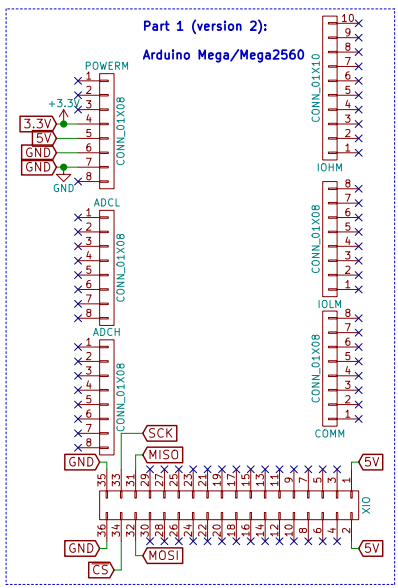
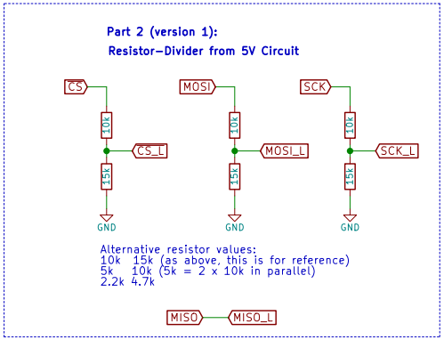
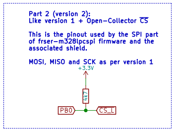
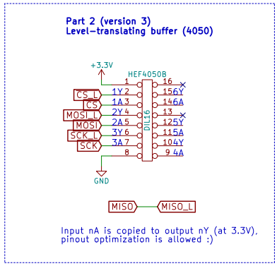
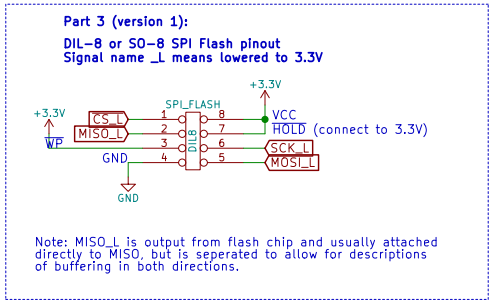
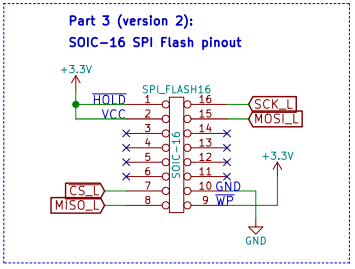
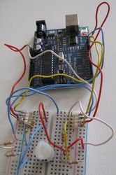
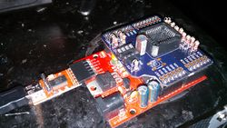
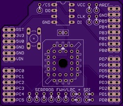

===============
Arduino flasher
===============

.. container:: danger, admonition

   **WARNING**

   Make sure that the Arduino SPI voltages and the flash chip voltages matches: Without any extra resistors or level shifter,
   the Arduino Uno and Duemillanove SPI pins are at 5V, while most chips operate at 3.3v.

Hardware basics
===============

You'll need to have:

* a supported Arduino, these are

  * any based on the ATmega328 (/168/88 will work with small changes too), like the Arduino Uno R3.
  * Arduino Mega or Mega2560, but notice that the software has a different branch for them.

* a way to convert the 5V logic levels to 3.3V (except if 3.3V arduino, these are rarer)
* a 3.3V SPI flash chip that is supported by flashrom

Notes:

* The FTDI based usb-serial converters are the fastest.
* 1.8V conversion isnt covered here, yet.

There are some simple schematics included here (`source <https://github.com/flashrom/wiki-arduino-spi-example-schematics>`_).
The idea is that you pick one version from each part 1 through 3, and connect the pin/net names.

Part 1: The Arduino
-------------------

ATmega328 based ones:

For the Arduino Megas:

Part 2: Level translation
-------------------------

There are a few options here, ranging from the simple resistors (v1) to a buffer chip (v3).

One thing to remember about the resistor dividers is that they're not strong enough to do ISP.

Here's the simple resistors:

The part count for the resistor divider is 6 resistors of 2 types or 9 of one type.

Here's one with 5 resistors, the downside is that you'll need to modify the firmware a little:

The 3rd version is using the DIP16 HEF4050 buffer chip:

Part 3: The SPI Flash chip
--------------------------

The DIL-8 and SOIC-8 versions connect like this:

For the SMD SOIC-16 chips the pinout is:

Gallery of some flashers
========================

.. _arduino shield:

Alternative: Shield with SPI and LPC/FWH for 5V Arduinos
========================================================

`Firmware and hardware sources <https://github.com/urjaman/frser-m328lpcspi>`_

`Shield PCB shared at oshpark <https://oshpark.com/shared_projects/E6jwmbWy>`_

* This shield and firmware was built for 5V ATMega328s with FTDI, variations to that will need adaptations in building the shield and/or in the firmware.
  The Uno R3 will work with the fast-usbserial U2 firmware.
* This shield uses a different pin for SPI CS than the other circuits on this page, and has LPC/FWH capability, thus different firmware.
  Frser-duino does have the code for using the CS like in this shield, but you need to modify spihw.h.
* Note: do check for any incompatibilities between your arduino and the shield, eg. the PD7 used as LPC CLK clashes with BT reset in BT arduinos.
* For LPC/FWH, current (16/02/01) flashrom trunk will be really slow, please use this branch instead.

Software and setup
==================

The Arduino Uno R3 and other arduinos with an ATmega8U2/16U2 as an usb-serial converter have lots of bugs in their usb-serial firmware
that prevent it from operating at more than a limited 115200 baud. The frser-duino firmware works around this by default if you use the appropriate make target,
but there exists a firmware that allows these to be used like the FTDI at 2Mbaud: `fast-usbserial <https://github.com/urjaman/fast-usbserial>`_.

Setup
-----

Required software
^^^^^^^^^^^^^^^^^

To make it work you need:

* A recent flashrom with the serprog protocol compiled in (most packaged versions do)
* `frser-duino which runs on the arduino <https://github.com/urjaman/frser-duino>`_

  * This page used to link to `serprog-duino <https://gitorious.org/gnutoo-personal-arduino-projects/serprog-duino>`_,
    frser-duino should build in a similar fashion and has better serial buffering and some other features (spi speed setting).

* The avr toolchain(avr-gcc, avr-libc,make etc...)

Building the software
^^^^^^^^^^^^^^^^^^^^^

First get the firmware source::

  $ git clone --recursive git://github.com/urjaman/frser-duino
  $ cd frser-duino

Then build it:

For a board with a 8u2 or a 16u2::

  $ make u2 && make flash-u2

For a board with an ftdi::

  $ make ftdi && make flash-ftdi

Building for the Mega1280 or 2560
^^^^^^^^^^^^^^^^^^^^^^^^^^^^^^^^^

As above, except use the branch for the 1280::

  $ git clone --recursive git://github.com/urjaman/frser-duino -b arduino-mega-1280

For the Mega2560, change the Makefile to target the correct MCU (replace 1280 with 2560). Please also verify that the avrdude command is as expected for your device.

Running flashrom
^^^^^^^^^^^^^^^^

The right flashrom arguments are explained in the :doc:`/classic_cli_manpage`, or here.

Available targets:

* ftdi, flash-ftdi:
  For the Arduinos with an FTDI
  compatible flashrom arguments::

    flashrom -p serprog:dev=/dev/ttyUSB0:2000000

  Other boards using an hardware USB<->Serial converter might work too.

* u2, flash-u2:
  For the Arduino with a 8u2 or a 16u2
  compatible flashrom arguments::

    flashrom -p serprog:dev=/dev/ttyACM0:115200

So for a board that has an ftdi that would give::

  flashrom -p serprog:dev=/dev/ttyUSB0:2000000

Speed
^^^^^

The speed is very dependant on the flash chip used:

* Its capacity impacts the speed a lot, as you would expect.
* The chip model as also a huge impact.

Duemillanove
^^^^^^^^^^^^

With the duemillanove::

  # time flashrom -p serprog:dev=/dev/ttyUSB0:2000000 -r duemillanove.rom
  flashrom v0.9.7-r1711 on Linux 3.18.3-gnu-1 (i686)
  flashrom is free software, get the source code at http://www.flashrom.org

  Calibrating delay loop... delay loop is unreliable, trying to continue OK.
  serprog: Programmer name is "serprog-duino"
  Found Winbond flash chip "W25Q32.V" (4096 kB, SPI) on serprog.
  Reading flash... done.
  flashrom -p serprog:dev=/dev/ttyUSB0:2000000 -r duemillanove.rom

we have::

  4.23s user 0.29s system 8% cpu 56.010 total

Uno
^^^

With the Arduino uno::

  # flashrom -p serprog:dev=/dev/ttyACM0:115200 -r uno.rom
  flashrom v0.9.7-r1711 on Linux 3.18.3-gnu-1 (i686)
  flashrom is free software, get the source code at http://www.flashrom.org

  Calibrating delay loop... delay loop is unreliable, trying to continue OK.
  serprog: Programmer name is "serprog-duino"
  Found Winbond flash chip "W25Q32.V" (4096 kB, SPI) on serprog.
  Reading flash... done.
  flashrom -p serprog:dev=/dev/ttyACM0:115200 -r uno.rom

we have::

  4.77s user 0.65s system 1% cpu 6:02.43 total

Tested chips
^^^^^^^^^^^^

* SST25VF016B => huge issues, not recognized by the 3.3v version, had to use the 5v version which is over maximum allowed voltage,
  also had to lower the serial speed to 115200, ultra slow to write(seem related to the chip itself, since that with the openmoko programmer it's even slower...)...
* W25X80 works well in 3.3v mode(5v works also but it's highly not advised to use 5v)
