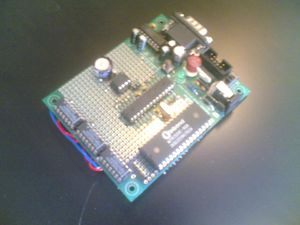
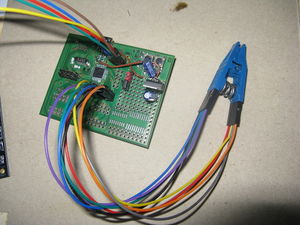
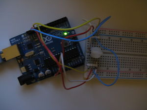
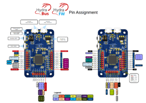

==================
Serprog (overview)
==================

This page collects information about the serprog protocol and the programmers implementing it.

Protocol
========

See :doc:`/supported_hw/supported_prog/serprog/serprog-protocol`. It is designed to be compact and allow efficient storage in limited memory of programmer devices.

AVR flasher by Urja Rannikko
============================

The Prototype RS232 AVR parallel flash programmer of Urja Rannikko was the first implementation of the serprog protocol.

The source code can be found `here <https://github.com/urjaman/frser-atmega88>`_.

InSystemFlasher by Juhana Helovuo
=================================

This was the first one that talks to SPI devices via serial over USB.
Details can be found in the `coreboot wiki <https://www.coreboot.org/InSystemFlasher>`_ and in this
`coreboot mailing list thread <https://mail.coreboot.org/pipermail/coreboot/2011-February/063349.html>`_.

atmegaXXu2-flasher by Stefan Tauner
===================================

Like the InSystemFlasher this one uses LUFA on an AVR microcontroller to tunnel the serial data over USB.

Various Arduino based flashers
==============================

Frser-duino
-----------

This project contains `source code <https://github.com/urjaman/frser-duino/>`_ to install on Arduino devices.

This developer also have various ports on `github repo <https://github.com/urjaman?tab=repositories>`_ for several microcontroller boards, such as:

* `frser-teensyflash <https://github.com/urjaman/frser-teensyflash>`_: A port for the teensy microcontroller board

There also various other interesting projects such as:

* `fast-usbserial <https://github.com/urjaman/fast-usbserial>`_: A software to make arduino with 8u2 or 16u2 flashing faster and more reliable]
* :ref:`arduino shield`

Using a 5v Arduino at 3.3V
--------------------------

Information on it can be found in this doc: :doc:`/supported_hw/supported_prog/serprog/arduino_flasher_3.3v`

5V arduino with level shifter
-----------------------------

For detailed instructions on how to use different Arduino models to access SPI flash chips see :doc:`/supported_hw/supported_prog/serprog/arduino_flasher`

Teensy 3.1 SPI + LPC/FWH Flasher
--------------------------------

A Teensy 3.1 based small flasher by Urja Rannikko documented here: :doc:`/supported_hw/supported_prog/serprog/teensy_3_1`

HydraBus multi-tool
-------------------

HydraBus (hardware) with HydraFW (firmware) is an open source multi-tool for learning, developing, debugging, hacking and penetration testing
of embedded hardware. It is built upon an ARM Cortex-M4 (STM32F405). The source code for HydraFW is available
`on GitHub <https://github.com/hydrabus/hydrafw>`_. Refer to `their GitHub Wiki <https://github.com/hydrabus/hydrafw/wiki/HydraFW-SPI-guide#flashrom-usage>`_
for more details on how to use HydraBus with flashrom.

stm32-vserprog by Chi Zhang
-----------------------------

A powerful option is `stm32-vserprog <https://github.com/dword1511/stm32-vserprog#stm32-vserprog>`_, a firmware for various STM32-based boards
that turns them into serprog-based programmers with SPI clock speeds up to 36 MHz.

pico-serprog
------------

`pico-serprog <https://github.com/stacksmashing/pico-serprog>`_ by stacksmashing is a firmware for
`Raspberry Pi Picos <https://www.raspberrypi.com/documentation/microcontrollers/raspberry-pi-pico.html>`_ and other RP2040 based boards which turns them
into a serprog programmer.

Notable forks are:

`Riku_V's fork <https://codeberg.org/Riku_V/pico-serprog>`_ which uses the hardware SPI implementation instead of SPI over PIO (programmable IO) which
sacrifices arbitrary pinouts. The fork also implements custom USB descriptors which allow for custom udev-rules.
