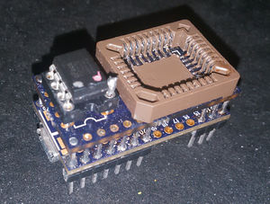

================================
Teensy 3.1 SPI + LPC/FWH Flasher
================================

Note: this was made for the Teensy 3.1, but 3.2 should be compatible too.

Hardware
========

The hardware is made of a `Teensy 3.1 <https://www.pjrc.com/teensy/teensy31.html>`_ and a shield-like PCB over it.
Schematic and board files for the PCB can be found `in the github <https://github.com/urjaman/frser-teensyflash/tree/master/hardware>`_.
The PCB is also shared `at OshPark <https://oshpark.com/shared_projects/izukIxq8>`_.

Other components required:

* pin headers (total 28, but get more)
* a DIL8 socket (if you want to use SPI DIL8)
* a PLCC32 SMD socket (if you want to use LPC/FWH)
* optional: small SMD capacitor - pad exists under the shield PCB

Assembly
--------

* start by installing the SMD cap (if available) and the DIL8 socket on the shield PCB
* split appropriate strips of pin headers for the teensy and solder them on the teensy, you can use the shield pcb to align them

  * my arrangement was as pictured in order to have more ground clearance under the teensy for the prog button

* push the shield pcb only a little bit on the pin headers, just so the headers dont come over the top of the PCB
* solder two corner pins to keep the shield PCB in place, these can be done from above
* solder the rest of headers from the underside while watching that you dont flood the topside with too much solder, especially for the ones close to the PLCC socket
* in order to solder the SMD PLCC32 socket, you'll need to break out the middle plastic bit, but keep it safe

  * to protect from solder bridges forming between the pin headers and PLCC socket, i placed a very thin tape over the pin header holes on the pcb during the soldering
  * notice that the PLCC footprint isnt centered on the PCB, meaning dont try to align the PLCC socket exactly on the PCB

* after soldering the PLCC socket, i installed the plastic bit back with a little bit of glue

Software
========

Firmware for the Teensy is available at https://github.com/urjaman/frser-teensyflash

Also see the README in that directory, both it or this document might be outdated ;)

As of writing the setup would be:

* download arduino, extract it somewhere where you have write access
* download the `Teensyduino thingy <https://www.pjrc.com/teensy/td_download.html>`_
* run it on that arduino tree
* install the udev rules provided in the above url
* compile and install the `teensy_loader_cli <https://www.pjrc.com/teensy/loader_cli.html>`_ in your path

  ::

    git clone --recursive https://github.com/urjaman/frser-teensyflash.git
    cd frser-teensyflash
    nano Makefile # Edit the TEENSYDIR path to include your arduino directory
    make
    make program-cli # If this waits you need to press the PROG button on the teensy

After this you should be able to use it with flashrom serprog, for speedups and enhancements to serprog before they're upstreamed
I'd suggest to use this flashrom tree: https://github.com/urjaman/flashrom/tree/sp-upstream3

Device should be something like /dev/ttyACM0 and the baudrate doesnt matter::

  flashrom -p serprog:dev=/dev/ttyACM0:2000000

ISP Usage
---------

The same software could be used on a bare teensy 3.1 for ISP SPI programming - this is untested and also the 3.3V supply in the teensy is not strong, so beware, but the SPI pins used would be:

* CS: "Pin 2", PD0
* SCK: "Pin 14", PD1
* MOSI: "Pin 7", PD2
* MISO: "Pin 8", PD3

See https://forum.pjrc.com/threads/25643-Combined-Pin-Assignments-card for a good Teensy pinmap picture.
