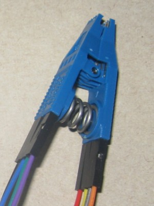
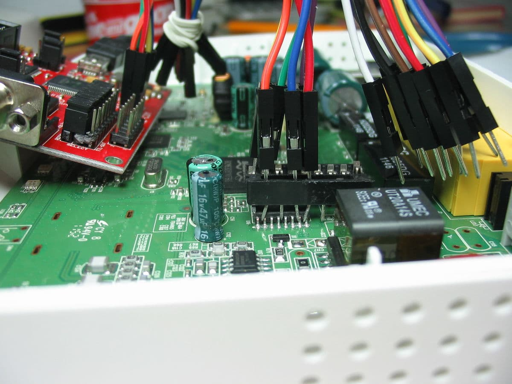

=====================
In-System Programming
=====================

**In-System Programming** (ISP) sometimes also called **in situ programming** is used to describe
the procedure of writing a flash chip while it is (already/still) attached to the circuit
it is to be used with. Of course any normal "BIOS flash" procedure is a kind of ISP
but when we refer to ISP we usually mean something different: programming a flash chip by external means
while it is mounted on a motherboard.

This is usually done with SPI chips only. Some mainboards have a special header for this
(often named "ISP", "ISP1", or "SPI") and there should be no problem with accessing the chip
then as long as the wires are not too long.

If there is no special header then using a special SO(IC) clip is an easy and reliable way
to attach an external programmer. They are produced by different vendors (e.g. Pomona, 3M)
and are available from many distributors (e.g. Distrelec) for 20-50$/€.

Problems
========

* Check the other potential problems (:doc:`misc_notes`) with other types of programming setups first.
* The SPI bus is not isolated enough. Often parts of the chipset are powered on partially
  (by the voltage supplied via the Vcc pin of the flash chip). In that case
  disconnect Vcc from the programmer and power it with its normal PSU and:

  * Try powering up the board normally and holding it in reset (e.g. use a jumper instead of the reset push button).
  * Some chipsets (e.g. Intel ICHs/PCHs) have edge triggered resets. In this case holding them in reset will not work.
    This is especially a problem with Intel chipsets because they contain an EC (named ME by Intel, see :doc:`management_engine`),
    which uses the flash (r/w!). In this case you can trigger the reset line in short intervals.
    For example by connecting it to the chip select (CS) line of the SPI bus or a dedicated clock signal from the programmer.
    This should not be too fast though! Reset lines usually require pulses with a minimum duration.
  * On some boards, you can try disconnecting the ATX12V header (yellow/black wires only) from the motherboard,
    or even remove the CPU or RAM - if the programmer supports SPI sniffing, you may be able to verify that the there is no SPI traffic.

Images
========

Pomona 8-pin SOIC clip with attached jumper wires.

A cheap, but very fragile alternative: DIP socket as clip

