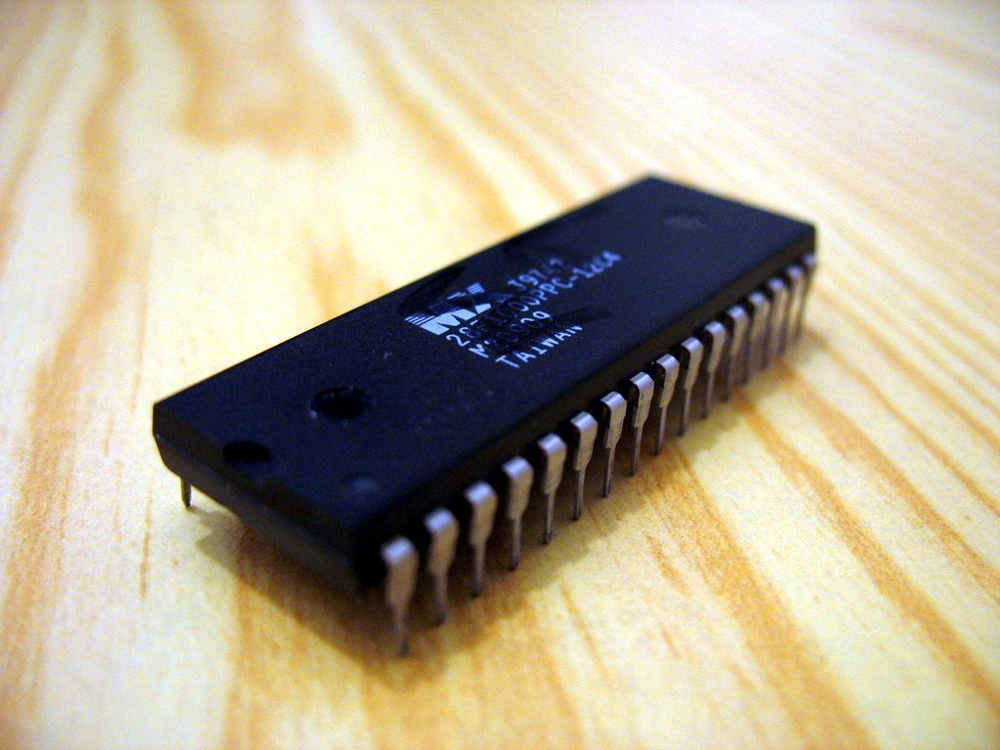
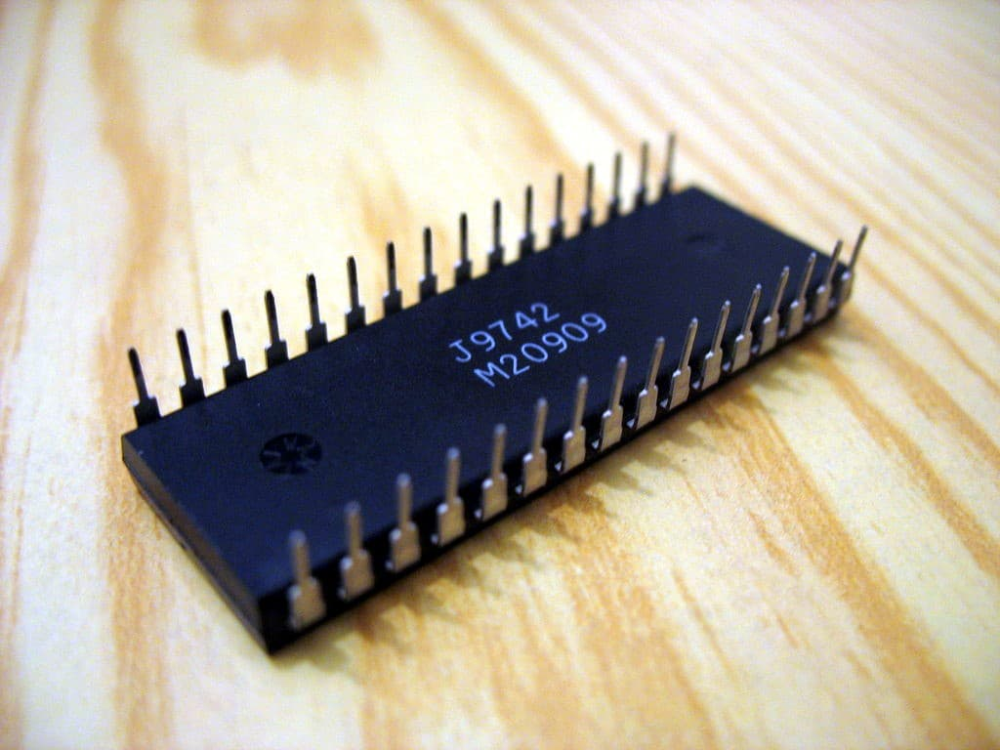
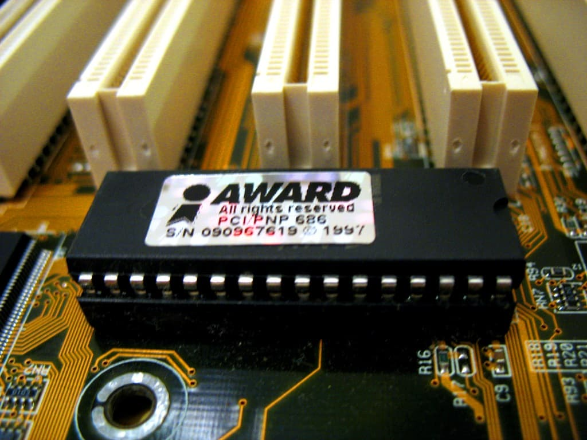
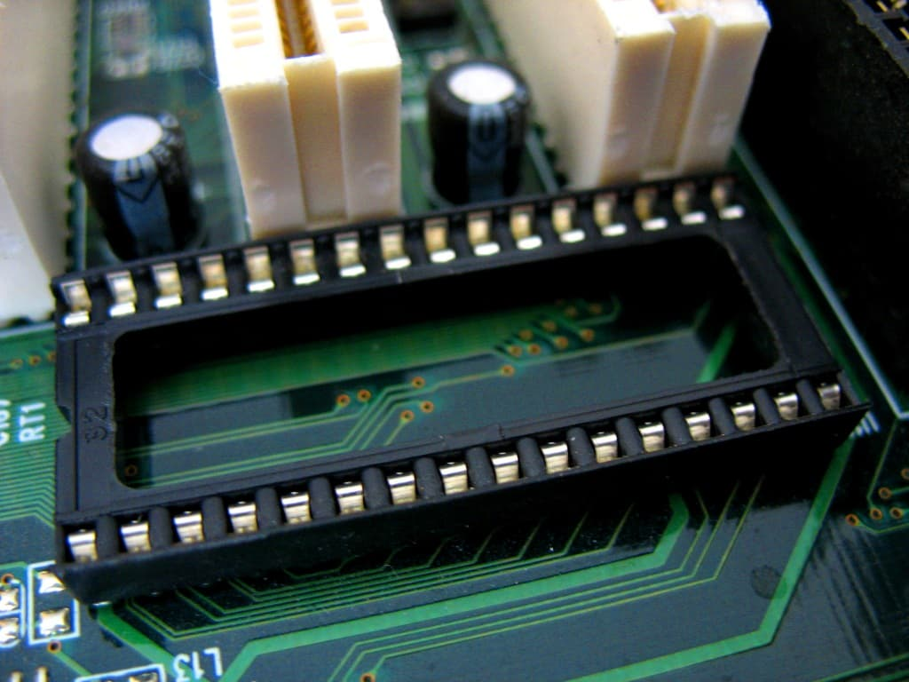
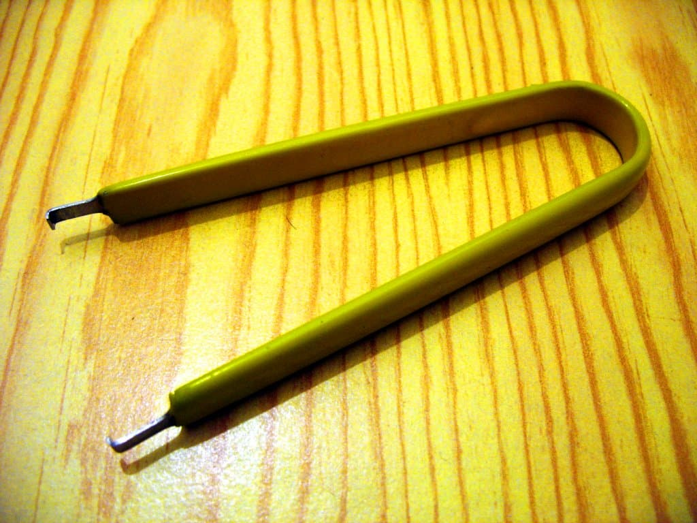

==========
Overview
==========

Modern mainboards store the BIOS in a reprogrammable flash chip.
There are hundreds of different flash (`EEPROM <https://en.wikipedia.org/wiki/EEPROM>`_) chips,
with variables such as memory size, speed, communication bus (Parallel, LPC, FWH, SPI) and packaging to name just a few.

Packaging/housing/form factor
=============================

DIP32: Dual In-line Package, 32 pins
------------------------------------

DIP32 top

DIP32 bottom

DIP32 in a socket

DIP32 socket

DIP32 extractor tool

A rectangular black plastic block with 16 pins along each of the two longer sides of the package
(32 pins in total). DIP32 chips can be socketed which means they are detachable from the mainboard
using physical force. If they haven't been moved in and out of the socket very much,
they can appear to be quite difficult to release from the socket. One way to remove a DIP32 chip
from a socket is by prying a **thin screwdriver** in between the plastic package and the socket,
along the shorter sides where there are no pins, and then gently bending the screwdriver to push
the chip upwards, away from the mainboard. Alternate between the two sides to avoid bending the pins,
and don't touch any of the pins with the screwdriver (search about ESD, electro-static discharge).
If the chip is **soldered directly to the mainboard**, it has to be desoldered in order to be
reprogrammed outside the mainboard. If you do this, it's a good idea to
`solder a socket to the mainboard <http://www.coreboot.org/Soldering_a_socket_on_your_board>`_ instead,
to ease any future experiments.

PLCC32: Plastic Leaded Chip Carrier, 32 pins
--------------------------------------------

PLCC32 top

 .. image:: Plcc32_chip.jpg
    :alt: PLCC32 top

PLCC32 botto

 .. image:: Plcc32_chip_back.jpg
    :alt: PLCC32 bottom

PLCC32 socket

 .. image:: Plcc32_in_socket.jpg
    :alt: PLCC32 socket

PLCC32 in a socket

 .. image:: Empty_plcc32_socket.jpg
    :alt: PLCC32 in a socket

Soldered PLCC3

 .. image:: Soldered_plcc32.jpg
    :alt: Soldered PLCC32

Two soldered PLCC32

 .. image:: Dual_plcc32_soldered.jpg
    :alt: Two soldered PLCC32

PLCC32 Bios Savior

 .. image:: Bios_savior.jpg
    :alt: PLCC32 Bios Savior

PLCC32 Top-Hat-Flash adapte

 .. image:: Top_hat_flash.jpeg
    :alt: PLCC32 Top-Hat-Flash adapter

PLCC32 pushpin trick

 .. image:: Pushpin_roms_2.jpg
    :alt: PLCC32 pushpin trick

PLCC extractor tool

 .. image:: Plcc_tool.jpg
    :alt: PLCC extractor tool

Black plastic block again, but this one is much more square.
PLCC32 was becoming the standard for mainboards after DIP32 chips because of its smaller physical size.
PLCC can also be **socketed** or **soldered directly to the mainboard**.
Socketed PLCC32 chips can be removed using a special PLCC removal tool,
or using a piece of nylon line tied in a loop around the chip and pulled swiftly straight up,
or bending/prying using small screwdrivers if one is careful. PLCC32 sockets are often fragile
so the screwdriver approach is not recommended. While the nylon line method sounds strange it works well.
Desoldering PLCC32 chips and soldering on a socket can be done using either a desoldering station
or even just a heat gun. You can also cut the chip with a sharp knife, **but it will be destroyed in the process, of course**.

DIP8: Dual In-line Package, 8 pins
----------------------------------

DIP8 top

 .. image:: Dip8_chip.jpg
    :alt: DIP8 top

DIP8 bottom

 .. image:: Dip8_chip_back.jpg
    :alt: DIP8 bottom

DIP8 in a socket

 .. image:: Dip8_in_socket.jpg
    :alt: DIP8 in a socket

DIP8 socket

 .. image:: Empty_dip8_socket.jpg
    :alt: DIP8 socket

Most recent boards use DIP8 chips (which always employ the SPI protocol) or SO8/SOIC8 chips (see below).
DIP8 chips are always **socketed**, and can thus be easily removed (and hot-swapped),
for example using a small screwdriver. This allows for relatively simple recovery in case of an incorrectly flashed chip.

SO8/SOIC8: Small-Outline Integrated Circuit, 8 pins
---------------------------------------------------

Soldered SOIC8

 .. image:: Soic8_chip.jpg
    :alt: Soldered SOIC8

SOIC8 socket, front, closed

 .. image:: Soic8_socket_front_closed.jpg
    :alt: SOIC8 socket, front, closed

SOIC8 socket, half open

 .. image:: Soic8_socket_half_opened.jpg
    :alt: SOIC8 socket, half open

SOIC8 socket, open

 .. image:: Soic8_socket_open.jpg
    :alt: SOIC8 socket, open

SOIC8 socket, back

 .. image:: Soic8_socket_back.jpg
    :alt: SOIC8 socket, back

SOIC8 socket, chip nearby

 .. image:: Soic8_socket_with_chip.jpg
    :alt: SOIC8 socket, chip nearby

SOIC8 socket, chip inserted

 .. image:: Soic8_socket_with_chip_inserted.jpg
    :alt: SOIC8 socket, chip inserted

Another type of SOIC8 adapter

 .. image:: Spi-socket-dscn2913-1024x768.jpg
    :alt: Another type of SOIC8 adapter

Similarly to the DIP8 chips, these always use the SPI protocol.
However, SO8/SOIC8 chips are most often soldered onto the board directly without a socket.
In that case a few boards have a header to allow :doc:`in_system`. You can also desolder
a soldered SO8 chip and solder an SO8 socket/adapter in its place, or build
a `SOIC-to-DIP adapter <http://blogs.coreboot.org/blog/2013/07/16/gsoc-2013-flashrom-week-4/>`_.
Some of the cheapest SOIC ZIF sockets are made by `Wieson <https://www.wieson.com/go/en/wieson/index.php?lang=en>`_.
They have 3 models available - G6179-10(0000), G6179-20(0000) and a 16 pin version named G6179-07(0000).
They are available for example from `siliconkit <https://siliconkit.com/oc3/>`_,
`Dediprog <https://www.dediprog.com/>`_, as well as `alibaba <http://alibaba.com/>`_.
For the usual "BIOS" flash chips you want the G6179-10 model (look also for G6179-100000).
Dediprog usually has them or similar ones as well but has steep shipping costs and an unpractical minimum order quantity.

TSOP: Thin Small-Outline Package, 32, 40, or 48 pins
----------------------------------------------------

Soldered TSOP32

  .. image:: Amd_am29f010_tsop32.jpg
     :alt: Soldered TSOP32

Soldered TSOP32

  .. image:: Sst_39vf040_tsop32.jpg
     :alt: Soldered TSOP32

Soldered TSOP40

  .. image:: Soldered_tsop40.jpg
     :alt: Soldered TSOP40

Soldered TSOP48

  .. image:: Soldered_tsop48.jpg
     :alt: Soldered TSOP48

TSOPs are often used in embedded systems where size is important and there is no need
for replacement in the field. It is possible to (de)solder TSOPs by hand,
but it's not trivial and a reasonable amount of soldering skills are required.

BGA: Ball Grid Array
--------------------

BGA package flash

  .. image:: Flash-BGA.jpg
     :alt: BGA package flash

BGAs are often used in embedded systems where size is important and there is no need
for replacement in the field. It is not easily possible to (de)solder BGA by hand.

Communication bus protocol
==========================

There are four major communication bus protocols for flash chips,
each with multiple subtle variants in the command set:

* **SPI**: Serial Peripheral Interface, introduced ca. 2006.
* **Parallel**: The oldest flash bus, phased out on mainboards around 2002.
* **LPC**: Low Pin Count, a standard introduced ca. 1998.
* **FWH**: Firmware Hub, a variant of the LPC standard introduced at the same time.
  FWH is a special case variant of LPC with one bit set differently in the memory read/write commands.
  That means some data sheets mention the chips speak LPC although
  they will not respond to regular LPC read/write cycles.

Here's an attempt to create a marketing language -> chip type mapping:

* JEDEC Flash -> Parallel (well, mostly)
* FWH -> FWH
* Firmware Hub -> FWH
* LPC Firmware -> FWH
* Firmware Memory -> FWH
* Low Pin Count (if Firmware/FWH is not mentioned) -> LPC
* LPC (if Firmware is not mentioned) -> LPC
* Serial Flash -> SPI

SST data sheets have the following conventions:

* LPC Memory Read -> LPC
* Firmware Memory Read -> FWH

If both are mentioned, the chip supports both.

If you're not sure about whether a device is LPC or FWH, look at the read/write cycle definitions.

FWH

=========== ========== ============== ==========================================================
Clock Cycle Field Name Field contents Comments
=========== ========== ============== ==========================================================
1	    START      1101/1110      1101 for READ, 1110 for WRITE.
2	    IDSEL      0000 to 1111   IDSEL value to be shifted out to the chip.
3-9	    IMADDR     YYYY	      The address to be read/written. 7 cycles total == 28 bits.
10+	    ...	       ...	      ...
=========== ========== ============== ==========================================================

LPC

=========== =================== ============== ==========================================================
Clock Cycle Field Name	        Field contents Comments
=========== =================== ============== ==========================================================
1	    START	        0000	       ...
2	    CYCLETYPE+DIRECTION	010X/011X      010X for READ, 011X for WRITE. X means "reserved".
3-10	    ADDRESS	        YYYY	       The address to be read/written. 8 cycles total == 32 bits.
11+	    ...	                ...	       ...
=========== =================== ============== ==========================================================

Generally, a parallel flash chip will not speak any other protocols.
SPI flash chips also don't speak any other protocols.
LPC flash chips sometimes speak FWH as well and vice versa,
but they will not speak any protocols besides LPC/FWH.

Hardware Redundancy
===================
Gigabyte's DualBios: http://www.google.com/patents/US6892323

ASUS: http://www.google.com/patents/US8015449
