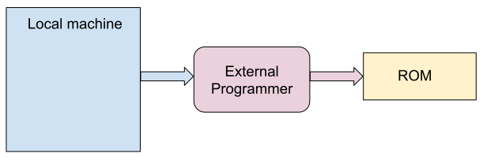
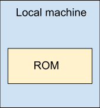
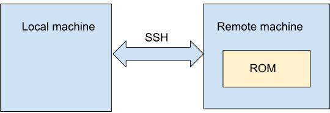
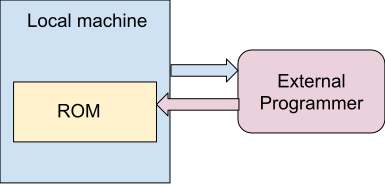
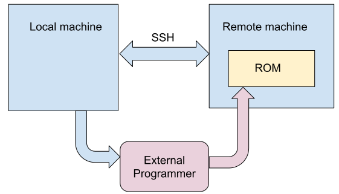

# Ubertest
## Intro / Features

Ubertest is a blackbox regression test for flashrom. It requires two flashrom binaries, one of which is assumed to be an older or stable version and the other which is the new version being tested.

Tests can be run on the local host or on a remote machine (via SSH). Additionally, the ubertest script supports using a secondary programmer to check the result of the primary programmer.

Ubertest supports multiple modes of operation which allow regions to be flashed selectively based on presence of a layout file or integrated layout mapping:
- Clobber mode: The entire ROM can be used for testing.
- Layout mode: Target a region using a flashrom layout file.
- Descriptor mode: Target a region using an Intel flash descriptor (Intel systems)
- Flashmap mode: Target a region using a flashmap

The tests assume that we care about 4KiB and 64KiB sector/block sizes. Some large ROMs available today only support 64KiB block erase operations, however testing on large regions can be impractical for many devices. The `--small-region` option may be used to restrict tests to using a smaller amount of flash memory (currently 16KiB).

### Terminology

- DUT: Device under test
- Local host: The machine which is running the script. It might also be the DUT.
- Remote machine: DUT controlled via SSH with primary programmer.
Programmers
	- Primary programmer: The programmer which will be tested using the new version of flashrom.
	- Secondary programmer: An optional programmer which will be used along with the old version of flashrom to verify the result of the primary programmer. This is generally assumed to be an external programmer connected to the local host e.g. via USB or serial. It may also be a secondary internal interface, for example if the DUT has a SPI ROM and both linux_spi and linux_mtd support and the developer wishes to test one against the other.

## Basic Usage

For a full list of options use `-h/--help`.

### Mandatory Options

`-n/--new <path>`: New (unstable) flashrom binary to test. Also see Note 1 below.

`-t/--type <type>`: Type of test to run:
- Single test: A single test of the specified mode will be run. If this type is selected, then a mode must also be specified.
- Endurance test: The ROM will be erased/written with random content until the first failure.

`-p/--primary-programmer`: Primary programmer options, e.g. “internal”, “ch341a_spi”, etc.

**Note 1**: When a remote host is used these options refer to files that are on the remote host, not the local host. See Testing on a Remote Host/DUT below.

**Note 2**: The script will default to using ${PATH}/flashrom if no old (presumably stable) flashrom binary is specified using -o/--old.

### Other Options

`-b/--backup-image`: Backup image that will be flashed to the target ROM unconditionally when the script is done. If unspecified, the script will read the ROM first using the stable flashrom binary to obtain a backup image. If remote host is used, backup image will be copied to local host’s temporary directory in case something goes terribly wrong. Also see Note 1 below.

`-o/--old <path>`: Old (stable) flashrom binary to test.

`--custom-hooks`: This allows the user to specify a script containing functions which are run at certain points during ubertest. These functions are intended to adapt the test script to the user’s environment. For example, the user can supply their own `preflash_hook()` and `postflash_hook()` to toggle power enable for the flash chip, instruct other devices with access to the flash chip to suspend access, etc.

`--local-flashrom`: If a remote host and a secondary programmer are used, then a local copy of flashrom is used to control the secondary programmer. This is because the “old” and “new” binaries reside on the remote host, and the secondary programmer is controlled from the local host. This defaults to `sudo which flashrom`.

`-m/--mode <mode>`: Mode to operate in (Mandatory if single test type is chosen):
- Clobber mode: Any portion of the ROM may be used for testing.
- Layout mode: Portions specified using a layout file will be erased/written. A layout file must be provided using -l/--layout-file option. The user may specify a region to use for testing with the --layout-region option.
- Descriptor mode (Intel systems only): Flashrom will read the flash descriptor from the DUT’s firmware ROM to determine which region to write to. The user may specify a region to use for testing with the --descriptor-region option.
- Flashmap mode: Flashrom will read the flashmap from the DUT’s firmware ROM to determine which region to write to. The user may specify a region to use for testing with the --flashmap-region option.

`--no-clean`: Do not remove temporary files if the script succeeds. Temporary files remain in the event of failure whether or not this option is used. This option is intended for developers for debugging the script.

`--skip-consistency-check`: By default, the script will read the ROM twice as a sanity check for consistent readings. This option is intended for developers for faster iteration, but should not be used in most cases.

`--small-region`: Skip parts of the tests that require a large (>16KiB currently ) region to work with. This is useful for small or densely packed firmware ROMs (especially those on microcontrollers/ECs) that do not have space for the default set of tests which may assume minimum eraseblock size of 64KB.

`-v/--voltage`: Supply voltage (in millivolts) for chip.

## Testing on a Remote Host/DUT

Ubertest supports testing on a remote host via SSH. A remote host is specified by IP address or hostname using the `-r/--remote-host` option. If used, the remote host becomes the DUT. The remote host should accept non-interactive root login from the local host.

Remote testing modifies the meaning of arguments supplied to some options. In particular, paths specified to options such as `-n`, `-o`, `-l`, and `-b` will refer to files on the remote host’s filesystem instead of the local host’s filesystem.

To use a remote host as your DUT, use the following options:

`-r/--remote-host <host>`: The remote host by IP address or hostname.

`--ssh-port <port>`: Specify SSH port to use (default: 22).

## Testing With a Secondary Programmer

Ubertest can be used with up to two programmers. The secondary programmer is used with the old/stable version of flashrom to verify the primary programmer and new version of flashrom at each step.

TODO: Change “secondary programmer” to “external programmer”? That could simplify the script significantly, especially in cases where a remote host + external programmer is used.

To use a secondary programmer, use the following options:
`-s/--secondary-programmer <parameters>`: Specify the secondary programmer the same way you do with -p/--primary-programmer.

## Test methods / examples

The purpose of ubertest is to automate a few simple tests in a way that can be invoked in a variety of environments (see Configurations / Setup).

The “single” mode tests boils down to:
- Read the targeted section of the ROM twice to check for consistency.
- Test 4KiB block write capabilities:
- Write the lower half of a block and ensuring that data in the upper half is restored to its original state.
- Write over the boundary of two blocks, ensuring the data outside the targeted region is restored to its original state.
- Write the upper half of a block, ensuring that data in the lower half restored to its original state
- Write a full block.
- Repeat step 2 for 64KiB blocks unless `--small-region` is used.

### Configurations / Setup
There are a few possible setups (shown below) involving a local machine, a remote machine, an external programmer, and the ROM to be tested. For the example commands in each setup the command takes a set of options, `MY_OPTS`. Depending on the type of test and potentially the mode, `MY_OPTS` will be different. To get the correct `MY_OPTS` for a specific test (and mode), see _Examples (Basic)_ and _Examples (Advanced)_ below. In general, any test type/mode can be run in any configuration.

#### Targeting external ROM connected to an external programmer

`flashrom$ sh util/ubertest/ubertest.sh -p ext_prog $MY_OPTS`

#### Targeting local host’s ROM using internal programmer

`flashrom$ sh util/ubertest/ubertest.sh -p internal $MY_OPTS`

#### Targeting remote host's ROM using its internal programmer

`flashrom$ sh util/ubertest/ubertest.sh -r remote_host -p internal $MY_OPTS`

#### Targeting local host’s ROM using external programmer

`flashrom$ sh util/ubertest/ubertest.sh -p internal -s ext_prog $MY_OPTS`

#### Targeting remote host's ROM using its internal programmer, and checking the result using an external (secondary) programmer
`flashrom # sh util/ubertest/ubertest.sh -p internal -s ext_prog -r remote_host $MY_OPTS`

In this configuration the "old" and "new" flashrom binaries will be on the remote host. However in order to control the external programmer that will be used to check the result, a local flashrom binary must be supplied using `--local-flashrom`.

### Examples (Basic)
#### Single Test

For each region layout mode, we will assume a different set of common options in `MY_OPTS`. For details on the possible configurations, as well as their corresponding example commands, see Configurations / Setup above.

#### Clobber Mode

`MY_OPTS=”-n new_flashrom -o old_flashrom -t single -m clobber”`

The clobber mode test will clobber (no surprise there!) the ROM with random content. If this operation is successful, then a partial write test will be run on the entire chip in order to test corner cases.

#### Layout Mode

`MY_OPTS=”-n new_flashrom -o old_flashrom -t single -m layout -l layout.txt -layout-region RW”`

#### Descriptor Mode

`MY_OPTS=”-n new_flashrom -o old_flashrom -t single -m descriptor --descriptor-region bios”`

#### Flashmap Mode

`MY_OPTS=”-n new_flashrom -o old_flashrom -t single -m flashmap --flashmap-region RW_SECTION”`

### Examples (Advanced)

For the following test types, we will assume the set of common options `MY_OPTS`. For details on each configuration, as well as the corresponding example command, see Configurations / Setup above.

##### Endurance Test
`MY_OPTS=”-n new_flashrom -o old_flashrom -t endurance”`

The endurance test will repeatedly run single Clobber Mode tests until the first failure. This is intended to test the capabilities of the flash chip. It is important to note that a full test can take a while (potentially more than a week or two) to complete. The average time for one iteration of the endurance test using a remote host with a SPI ROM operating at 50MHz is around 100 seconds. This process will likely take longer for boards with larger chip sizes, and also longer for configurations that use an external programmer. At 1 iteration every 100 seconds, which is a relatively high speed, around 6048 iterations will be run in a week (probably a little less than that because the time spent between iterations will accumulate to a significant amount).

## Document Information
Authors: David Hendricks <dhendrix@chromium.org>, Souvik Ghosh

Original document short URL: <https://goo.gl/3jNoL7>

Original document long URL: <https://docs.google.com/document/d/1IoBR7rHXJFiahC6dGnNKqaNFfg-q89_NMHuFyiJ7JnA/edit?usp=sharing>

This document is licensed under a Creative Commons Attribution 3.0 Unported License. Feel free to copy, modify, and distribute this document however you see fit with attribution to the Flashrom Community.
